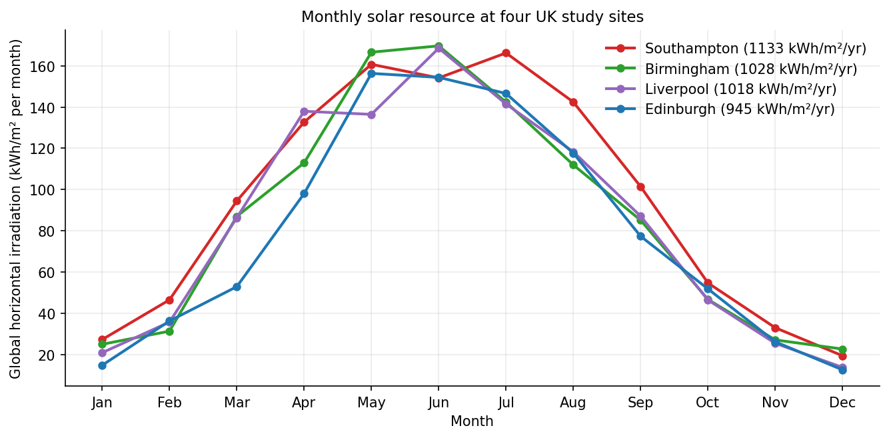
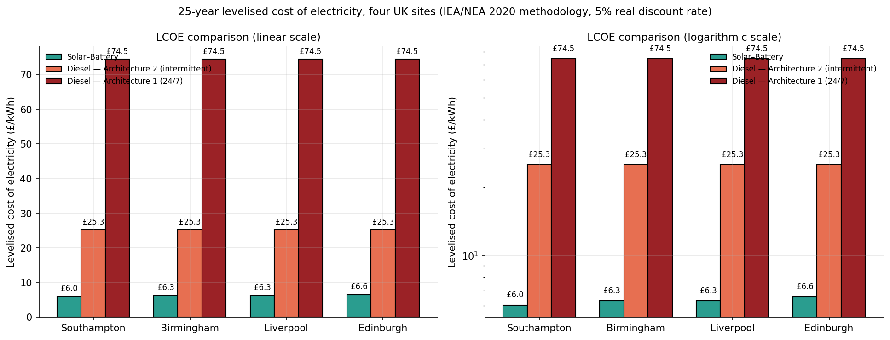
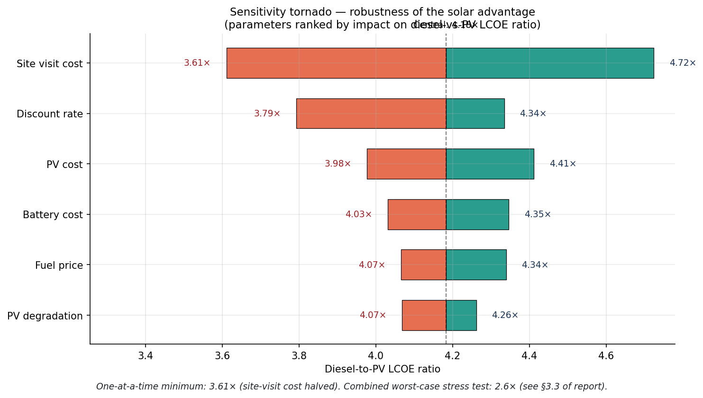

# Solar PV–Battery vs Diesel for UK Remote Monitoring Stations

Hourly techno-economic simulation comparing off-grid solar photovoltaic–battery systems against diesel generators for low-power remote environmental monitoring stations across **four UK climatic regimes**.

[](tests/)
[](LICENSE)
[](https://www.python.org/)
[](data/pvgis/)

---

## The question

Can a solar PV–lithium iron phosphate battery system reliably and economically replace a diesel generator for a UK remote monitoring station — and does the answer hold across the UK's latitudinal solar-resource gradient, from Southampton to Edinburgh?

## The answer

Yes. Solar-battery is **3.85–4.18× cheaper** than realistic diesel at the central assumptions, and remains **2.23–2.62× cheaper** even under the most diesel-favourable parameter combination tested.

---

## Study sites

| Site | Latitude | Climate | Real PVGIS GHI (kWh/m²/yr) | Optimal PV |
|---|---|---|---|---|
| Southampton | 50.91°N | South coast | 1133 | 400 Wp |
| Birmingham  | 52.49°N | Midlands inland | 1028 | 500 Wp |
| Liverpool   | 53.41°N | NW maritime | 1018 | 500 Wp |
| Edinburgh   | 55.95°N | Scottish lowlands | 945 | 600 Wp |

All sites use 1.0 kWh LFP battery storage.  
Weather data: **real PVGIS-SARAH2 TMY** (2005–2020 satellite record).

---

## Key results

| System | LCOE @ 5% Green Book | LCOE @ 8% commercial WACC |
|---|---|---|
| Solar — Southampton (400 Wp) | £6.04/kWh | £6.54/kWh |
| Solar — Birmingham  (500 Wp) | £6.30/kWh | £6.88/kWh |
| Solar — Liverpool   (500 Wp) | £6.30/kWh | £6.88/kWh |
| Solar — Edinburgh   (600 Wp) | £6.56/kWh | £7.23/kWh |
| Diesel — Architecture 2 (intermittent, realistic) | £25.27/kWh | £25.83/kWh |
| Diesel — Architecture 1 (continuous 24/7, worst) | £74.49/kWh | £75.00/kWh |

**Combined worst-case** (10% discount rate, PV/battery +30%, cheapest historical fuel, halved visit cost):
solar remains 2.23–2.62× cheaper depending on site.

The single most influential parameter is **site-visit logistics**, not fuel price.

---

## Figures

Monthly solar resource across four sites:



25-year LCOE comparison:



Sensitivity tornado:



---

## Quick start

```bash
# Install dependencies
pip install pvlib pandas numpy matplotlib scipy requests pytest

# Weather data is already in data/pvgis/ (real PVGIS-SARAH2 files)
# To re-fetch from PVGIS API
python -m src.fetch_pvgis

# Run optimal sizing for all four sites
python -m src.sizing

# Regenerate all 7 figures (uses real PVGIS data by default)
python -m src.figures

# Run the test suite
python -m pytest tests/ -v
```

---

## Repository structure

```
src/                     Core simulation and economic modelling
  ├── sites.py           Four UK study sites with coordinates
  ├── load_profile.py    14.6 W continuous monitoring station load
  ├── weather.py         PVGIS TMY loader + synthetic fallback
  ├── pv_model.py        pvlib: PVWatts DC + Hay-Davies + SAPM cell temperature
  ├── battery.py         LFP battery state-of-charge tracker
  ├── simulation.py      8,760-hour hourly energy-balance simulation
  ├── sizing.py          Auto-sizing grid search (targets LOLP < 1%)
  ├── diesel.py          Two diesel architectures with full lifecycle costs
  ├── economics.py       IEA/NEA (2020) DCF — LCOE, NPV at 5% and 8%
  ├── sensitivity.py     One-at-a-time tornado + combined worst-case
  ├── figures.py         All 7 dissertation figures (real PVGIS by default)
  ├── fetch_pvgis.py     PVGIS-SARAH2 data retrieval
  └── convert_manual_pvgis.py  Converts manually-downloaded PVGIS CSVs

tests/
  └── test_simulation.py  16 pytest sanity checks (all passing)

data/
  ├── pvgis/             Real PVGIS-SARAH2 TMY hourly files (see data/pvgis/README.md)
  ├── load/              Load component specifications (see data/load/README.md)
  └── costs/             Economic assumption sources (see data/costs/README.md)

docs/
  └── assumptions.md     Full assumptions log with data sources and version history

figures/                 Publication-quality output PNGs (auto-generated)
results/                 CSV outputs from simulation runs
```

---

## Methodology

**Simulation:** 8,760-hour hourly energy balance. Battery SoC updated each timestep with LFP round-trip efficiency 92%, 80% depth-of-discharge, 2%/month self-discharge.

**Sizing:** Automated grid search across PV capacity (100–1000 Wp) × battery (0.5–20 kWh). Target: LOLP < 1% (< 88 unmet hours/year).

**Economics:** IEA/NEA (2020) discounted cash flow. Two discount rates:
- 5% real (HM Treasury Green Book STPR + technology premium)
- 8% real (typical UK commercial WACC for renewable-energy investment)

**Diesel architectures:**
- *Architecture 1:* Continuous 24/7 — 1 kW genset at 1.5% rated load, 3,504 L/year (worst case)
- *Architecture 2:* Intermittent + battery — genset cycles 4 hr/day at 30% load, 292 L/year (realistic)

**Sensitivity:** One-at-a-time variation across seven parameters + combined worst-case stress test (all parameters simultaneously at diesel-favourable extremes).

---

## Data sources

| Data | Source |
|---|---|
| Solar irradiance | PVGIS-SARAH2, European Commission JRC (2005–2020) |
| Battery costs | BloombergNEF Energy Storage System Price Survey 2025 |
| UK red diesel prices | AHDB Fuel Prices (2012–2025) |
| CO₂ emission factors | DESNZ GHG Conversion Factors 2025 |
| Solar PV costs | DESNZ Solar PV Cost Data 2025 |
| LCOE methodology | IEA/NEA Projected Costs of Generating Electricity 2020 |
| Discount rate | HM Treasury Green Book 2022 |

---

## Validation

Real PVGIS data was retrieved for all four sites and compared against earlier synthetic estimates:

| Site | PVGIS GHI | Synthetic estimate | Difference | LOLP (real data) |
|---|---|---|---|---|
| Southampton | 1133 kWh/m²/yr | 1100 | +3% | 0.23% ✓ |
| Birmingham  | 1028 kWh/m²/yr | 1000 | +3% | 0.61% ✓ |
| Liverpool   | 1018 kWh/m²/yr | 970  | +5% | 0.89% ✓ |
| Edinburgh   |  945 kWh/m²/yr | 900  | +5% | 0.79% ✓ |

Real data revealed more severe spring shoulder-season irradiance than synthetic data captured. Optimal PV sizes were revised upward at Birmingham, Liverpool, and Edinburgh.

---

## Tests

```
python -m pytest tests/ -v
```

16 sanity checks covering load profile, battery model, diesel architectures, LCOE headline numbers, solar advantage at both 5% and 8%, and Liverpool-specific sizing.

---

## Status

- [x] Real PVGIS-SARAH2 data retrieved and validated (all four sites)
- [x] Hourly simulation framework complete
- [x] Optimal sizing confirmed on real data
- [x] Economic analysis at 5% and 8% discount rates
- [x] Sensitivity analysis (tornado + combined worst-case)
- [x] 7 publication-quality figures
- [x] 16 passing tests
- [ ] Final dissertation chapters 3–5 (August 2026)

---

## Citation

```bibtex
@mastersthesis{alobaidi2026,
  author  = {Al Obaidi, Omar Farooq Mahmood},
  title   = {Techno-Economic Comparison of Off-Grid Solar Photovoltaic--Battery
             and Diesel Generator Systems for Remote Environmental Monitoring
             Stations Across Four UK Climatic Regimes},
  school  = {Liverpool John Moores University},
  year    = {2026},
  note    = {MSc Renewable Energy, Module 7400MENR}
}
```

## License

Released under the [MIT License](LICENSE). Code is open-source.
