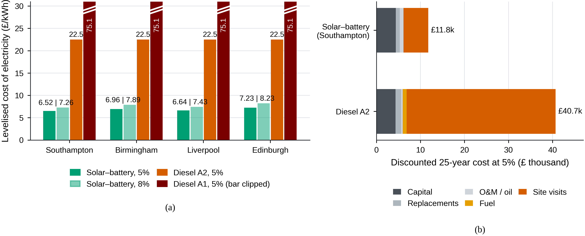
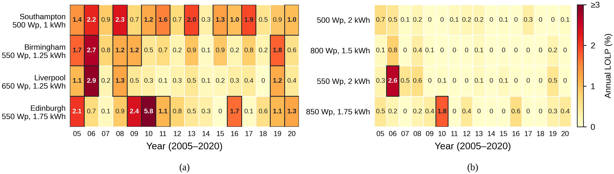
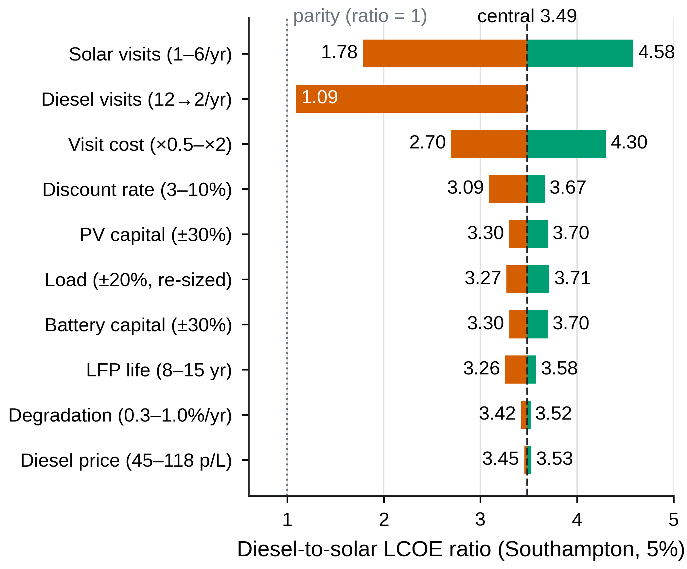

# Techno-Economic Feasibility of Off-Grid Solar PV–Battery Systems for Remote Environmental Monitoring in the UK

Hourly techno-economic model comparing an off-grid solar PV–lithium iron phosphate (LFP) battery supply with a small diesel generator for a 14.64 W continuous environmental-monitoring load at four UK sites (Southampton, Birmingham, Liverpool, Edinburgh). MSc dissertation code; every number in the paper is regenerated by one command (`python -m src.make_all`) and written to `results/numbers.json`.

[](tests/)
[](LICENSE)
[](https://www.python.org/)
[](data/pvgis_series/)

## The question

Can a solar PV–battery system replace a diesel generator for a UK remote monitoring station at a lower 25-year cost while holding a loss-of-load probability (LOLP) of 1% or less, and does the answer hold across the UK solar-resource gradient from Southampton (1,133 kWh/m²/yr) to Edinburgh (945 kWh/m²/yr)?

## The answer

Yes, provided the diesel comparator is attended monthly. With the final designs (below), the battery-buffered diesel LCOE (architecture A2) is 3.14 to 3.49 times the solar LCOE at a 5% real discount rate and 2.86 to 3.24 times at 8%. The advantage comes from the site-visit differential: site visits are 82.4% of the discounted 25-year cost of the diesel A2 system, fuel 2.2%. Parity is reached at 1.61 (Southampton) to 2.07 (Edinburgh) diesel visits per year at 5%. Under a combined worst case with monthly attendance the ratio falls to 1.36 to 1.62; combining the worst case with 6 diesel visits per year gives 0.88 to 1.04, and with 4 or 2 visits per year the ratio is below 1 at every site (0.72 to 0.85 and 0.56 to 0.66). All values are in `results/numbers.json`.

## Headline results

Final designs, central assumptions (PV £4.50/Wp, LFP £700/kWh, red diesel 76.02 p/L, 25 years, flat 128.2 kWh/yr served-energy denominator).

| Site | Final design | Solar LCOE 5% (£/kWh) | Solar LCOE 8% (£/kWh) | Diesel A2 / solar, 5% | Diesel A2 / solar, 8% |
|---|---|---|---|---|---|
| Southampton | 500 Wp + 2.0 kWh | 6.52 | 7.26 | 3.49 | 3.24 |
| Birmingham | 800 Wp + 1.5 kWh | 6.96 | 7.89 | 3.27 | 2.98 |
| Liverpool | 550 Wp + 2.0 kWh | 6.64 | 7.43 | 3.42 | 3.17 |
| Edinburgh | 850 Wp + 1.75 kWh | 7.23 | 8.23 | 3.14 | 2.86 |

- Diesel A2 (2 kVA-class set, battery-buffered, 0.915 h/day, 12 visits/yr): £22.72/kWh at 5%, £23.52/kWh at 8%. Diesel A1 (same set running continuously): £74.07/kWh at 5%, £74.43/kWh at 8%; A1 is 10.24 to 11.36 times the solar LCOE at 5%.
- Discounted 25-year cost at 5%: solar £11,775 (Southampton) to £13,071 (Edinburgh); diesel A2 £41,052; diesel A1 £133,825. Avoided cost against A2: £27,981 to £29,277 per station over 25 years.
- Diesel visit cadence (5%, Southampton): 12/6/4/2 visits per year give ratios of 3.49/2.05/1.57/1.09. Break-even cadence 1.61 (Southampton), 1.69 (Liverpool), 1.89 (Birmingham), 2.07 (Edinburgh) visits/yr at 5%; 1.58 to 2.20 at 8%.
- One-at-a-time tornado (ten parameters, Southampton, 5%): the ratio ranges from 1.78 to 4.58 over the solar visit count (1 to 6/yr), 1.09 to 3.49 over the diesel visit-cadence rows, 2.70 to 4.30 over visit cost, 3.09 to 3.67 over the discount rate, and 3.45 to 3.53 over the fuel-price rows (44.96 to 117.56 p/L).
- Monte Carlo (5,000 joint draws over seven sampled inputs including diesel capital x 0.7 to 1.3, seed 42): median ratio 3.27 (Edinburgh) to 3.59 (Southampton) at 5%, 2.99 to 3.35 at 8%; P10 2.75 to 3.07 at 5% and 2.49 to 2.85 at 8%; solar is cheaper in every draw (smallest ratio 2.05 at 5%, 1.83 at 8%).
- Combined worst case (10% rate, PV and battery capex +30%, diesel capex -30%, degradation 0.8%/yr with re-sized designs, fuel 44.96 p/L, visit costs halved for both systems, solar battery life 8 yr, monthly diesel attendance): 1.62 (Southampton), 1.57 (Liverpool), 1.47 (Birmingham), 1.36 (Edinburgh).
- Battery break-even capex (solar LCOE = diesel A2 LCOE): £9,800/kWh (Liverpool) to £12,597/kWh (Birmingham) at 5%; £8,450 to £10,739 at 8%; £7,718 to £9,728 at 10%. Over the 3 to 10% x 0.5 to 2.0 x battery-cost grid the smallest ratio is 2.33 (Edinburgh, 10%, twice the central battery cost).
- Validation of the PV chain against PVGIS on identical inputs (2005-2020, hourly): normalised mean bias +2.2% (Southampton) to +2.9% (Birmingham), hourly NRMSE 3.9 to 4.7%. The TMY chain sits +0.6% (Southampton), +2.1% (Birmingham, Liverpool) and +2.4% (Edinburgh) above the sixteen-year PVGIS mean and inside the sixteen-year annual band at every site. Terrain horizon at Edinburgh costs 0.24% of annual yield and 1.5% of December yield.
- The design condition at every site is the darkest multi-day winter sequence in the record: the worst sixteen-year events for the final designs are 28 Jan to 7 Feb 2005 at Southampton (57 unmet hours, study chain), 1 to 11 Jan 2006 at Birmingham (41 h), 22 to 31 Dec 2006 at Liverpool (147 h) and 1 to 11 Dec 2010 at Edinburgh (120 h).
- Cold-weather bounds (not part of the criterion): blocking battery charging in every hour at or below 0 degrees C raises the sixteen-year mean LOLP of the final designs to 0.29 to 0.84% (compliant years fall to 13 to 15 of 16); a 15% winter capacity derate gives 0.20 to 0.50% (15 to 16 years).
- Emissions: diesel A2 233 kg CO2e/yr (5.8 t over 25 years); A1 3,340 kg CO2e/yr (83.5 t).

## Two-step sizing

Step 1 (`src/sizing.py`): grid search (PV 100 to 1,250 Wp in 50 Wp steps; battery 0.75 to 10 kWh, seventeen values) on the PVGIS typical meteorological year (month selection drawn from the 2005-2023 satellite period; see data/pvgis/README.md) for the cheapest design (25-year NPV at 5%) that holds LOLP <= 1% in the design-governing year. The governing year is year 24 of 25: modules at (1 - 0.005)^23 = 0.891 of year-1 output and the battery at 80% state of health, the last year of the second battery's life. These designs are `SITE_DESIGN_TMY` in `src/monte_carlo.py`; provenance `results/sizing_summary.txt`.

Step 2 (`src/multiyear.py`): every grid design is run continuously through the sixteen real years 2005-2020 (PVGIS hourly series in `data/pvgis_series/`) under the same governing-year conditions, with two PV conversion models: `study` (this study's pvlib chain fed with the PVGIS plane-of-array components) and `pvgis` (PVGIS's own hourly output scaled to nameplate). The final design is the cheapest design with annual LOLP <= 1% in at least 15 of the 16 years under both models (`SITE_DESIGN`; provenance `results/multiyear_summary.txt`). All economics, sensitivity, Monte Carlo, sweeps and worst-case results use the final designs.

| Site | Step-1 TMY design | Years <= 1% (study / pvgis) | Final design | Years <= 1% (study / pvgis) | Mean annual LOLP, study (%) | LCOE change vs step 1 |
|---|---|---|---|---|---|---|
| Southampton | 500 Wp + 1.0 kWh | 6 / 2 | 500 Wp + 2.0 kWh | 16 / 15 | 0.15 | +10.5% |
| Birmingham | 500 Wp + 1.5 kWh | 11 / 5 | 800 Wp + 1.5 kWh | 16 / 15 | 0.11 | +12.0% |
| Liverpool | 600 Wp + 1.5 kWh | 14 / 12 | 550 Wp + 2.0 kWh | 15 / 15 | 0.31 | +2.9% |
| Edinburgh | 550 Wp + 1.75 kWh | 9 / 4 | 850 Wp + 1.75 kWh | 15 / 15 | 0.31 | +11.5% |

Sizing on year-1 conditions alone would give smaller designs (for example 450 Wp + 0.75 kWh at Southampton) whose governing-year LOLP on the TMY is 1.76 to 2.45%. Tightening the target to 0.1% under the final criterion raises the LCOE by a further 8.5% (Birmingham) to 18.2% (Liverpool).

## Model summary

- Load: 12.2 W of component draws (datalogger, four sensors, cellular modem, ancillaries) plus a 20% margin = 14.64 W continuous, 351.4 Wh/day, 128.2 kWh/yr (`src/load_profile.py`).
- PV chain (`src/pv_model.py`): latitude tilt, south-facing, Hay-Davies transposition, physical incidence-angle modifier on the beam component and Marion diffuse IAM, SAPM open-rack cell temperature, PVWatts DC (gamma -0.35%/K), then an explicit PVWatts-v5 loss chain with a 97% MPPT controller efficiency (12.7% total).
- Battery (`src/battery.py`, `src/simulation.py`): LFP energy-bucket model, 92% round-trip efficiency, 80% depth of discharge, 2%/month self-discharge, hourly two-pass simulation (the second pass starts from the first pass's final state of charge). LOLP = unmet hours / hours in the year.
- Diesel (`src/diesel.py`): 2 kVA-class (1.6 kW) air-cooled set. A1 runs 24 h/day at 0.9% load (1,211 L/yr, genset life 0.57 yr at a 5,000 h derated life). A2 recharges a lead-acid buffer at 30% load (480 W) for a runtime derived from the daily energy balance (351.36 Wh / 0.80 / 480 W = 0.915 h/day, 334 h/yr, 84.4 L/yr); its genset (8,000 h life) is replaced once, in year 24. Skarstein-Uhlen fuel curve; both attended monthly (£200 per visit).
- Economics (`src/economics.py`): IEA/NEA discounted-cash-flow LCOE at 5% (Green Book plus technology premium) and 8% (commercial WACC), 25 years, lumpy replacements with straight-line salvage credit, flat served-energy denominator for both systems.
- Uncertainty (`src/sensitivity.py`, `src/monte_carlo.py`, `src/sweeps_2d.py`): one-at-a-time tornado with exact multi-year re-sizing for the load and degradation rows, combined worst case, 5,000-draw Monte Carlo, discount-rate x battery-cost sweeps.
- Validation (`src/validation.py`): same-input hourly comparison with PVGIS 2005-2020 and TMY-chain comparison with the sixteen-year climatology.

Full parameter values with sources: `docs/assumptions.md`.

## Figures

LCOE by site and system, and the discounted 25-year cost breakdown (Southampton solar vs diesel A2, 5%):



Annual LOLP over 2005-2020 under governing-year conditions: step-1 TMY designs under (a) the study chain and (b) the PVGIS chain; final designs under (c) the study chain and (d) the PVGIS chain:



One-at-a-time sensitivity of the diesel-to-solar LCOE ratio (Southampton, 5%):



All ten paper figures are described in `figures/README.md`.

## Quick start

```bash
# Python 3.11+; numba is optional and speeds up the sixteen-year loops
pip install -e ".[dev,fast]"
# or: pip install pvlib pandas numpy matplotlib scipy requests pytest numba

# Reproduce every result, number and figure (about ten minutes on a laptop)
python -m src.make_all

# Run the test suite (47 tests)
python -m pytest tests -q
```

`src.make_all` runs, in order: `src.sizing` (step 1), `src.validation`, `src.multiyear` (step 2 and final designs), `src.make_results` (tables), `src.monte_carlo`, `src.sweeps_2d`, `src.dump_numbers` (`results/numbers.json`), `src.figures_paper` (`figures/paper/fig01` to `fig10`), then the tests (47). Each step can also be run on its own with `python -m src.<module>`; `python -m src.sensitivity` prints the one-at-a-time and tornado tables (its functions are called by `src.dump_numbers`, so it is not a separate `make_all` step). The weather inputs are committed, so no network access is needed; `python -m src.fetch_pvgis` and `python -m src.fetch_pvgis_series` re-download them.

## Repository structure

```
src/
  sites.py                Four study sites (coordinates, altitude)
  load_profile.py         14.64 W constant monitoring load
  weather.py              PVGIS TMY loader (cache in data/pvgis), synthetic fallback
  fetch_pvgis.py          Fetch the PVGIS TMY files (pvlib.iotools.get_pvgis_tmy)
  convert_manual_pvgis.py Convert TMY CSVs downloaded from the PVGIS web tool
  fetch_pvgis_series.py   Fetch the PVGIS 5.2 hourly series 2005-2020 (data/pvgis_series)
  pvgis_series.py         Loader for the hourly series; PVGIS Huld/Faiman power model
  pv_model.py             pvlib PV chain: Hay-Davies, IAM, SAPM, PVWatts DC, LossChain
  battery.py              LFP energy-bucket parameters
  simulation.py           Hourly energy-balance simulation (LOLP, curtailment, SoC)
  sizing.py               Step 1: TMY governing-year grid search, lifetime-NPV ranking
  validation.py           Upgrade 1: PV chain validation against PVGIS
  multiyear.py            Upgrade 2: sixteen-year reliability, final designs, re-sizing helper
  diesel.py               Diesel architectures A1 (continuous) and A2 (battery-buffered)
  economics.py            IEA/NEA DCF: cash-flow builders, LCOE, NPV, lumpy replacements
  sensitivity.py          One-at-a-time tornado, visit cadence, combined worst case
  monte_carlo.py          5,000-draw Monte Carlo; SITE_DESIGN / SITE_DESIGN_TMY constants
  sweeps_2d.py            Discount rate x battery cost sweeps, break-even battery cost
  make_results.py         Results tables (sizing_summary, lcoe_comparison, diesel_ops, resize_checks)
  dump_numbers.py         results/numbers.json, the single source of every quoted number
  figures_paper.py        Paper figures fig01 to fig10 (figures/paper)
  make_all.py             One-command reproduction of the whole pipeline
tests/
  test_simulation.py              22 tests: load, loss chain, battery, diesel, replacements, LCOE, reliability
  test_monte_carlo.py              7 tests: draws, plumbing, distribution bands
  test_validation_multiyear.py     9 tests: PVGIS series, validation, multi-year loop, final designs
data/
  pvgis/                  PVGIS TMY hourly files, one per site (README inside)
  pvgis_series/           PVGIS 5.2 hourly series 2005-2020, five files (README inside)
  load/                   Load component notes (README)
  costs/                  Cost assumption sources (README)
docs/
  assumptions.md          Full assumptions log with sources
figures/
  README.md               Description of the paper figures
  paper/                  fig01_monthly_ghi ... fig10_sweep2d (600 dpi PNG)
results/                  All generated results (README inside); numbers.json is authoritative
LICENSE                   MIT
pyproject.toml            Package metadata and dependencies
```

## Data provenance and reuse terms

- Weather: PVGIS typical meteorological year per site (month selection drawn from the 2005-2023 satellite period, SARAH-3; see data/pvgis/README.md) (`data/pvgis/`, retrieved with `pvlib.iotools.get_pvgis_tmy`) and PVGIS 5.2 `seriescalc` hourly series 2005-2020 (`data/pvgis_series/`, request parameters in `src/fetch_pvgis_series.py`). PVGIS © European Union, 2001-2026; the data are free to reuse with attribution to PVGIS (European Commission Joint Research Centre). Both data folders carry a README with the request parameters and column definitions.
- Costs and prices (see `data/costs/README.md` and `docs/assumptions.md`): PV £4.50/Wp (DESNZ Solar PV Cost Data 2025), LFP battery £700/kWh (BloombergNEF 2025 pack survey plus European premium), UK red diesel 76.02 p/L excluding VAT (AHDB fuel prices, 2025 mean; 44.96 to 117.56 p/L range), emission factor 2.75766 kg CO2e/L (DESNZ GHG conversion factors 2025), carbon values £264/t (2026) and £280/t (2030) in 2020 prices (DESNZ central values).
- Methods: IEA/NEA (2020) LCOE method; HM Treasury Green Book (2022) for the 5% public-sector rate; PVWatts v5 (Dobos, NREL/TP-6A20-62641) for the loss framework; Skarstein and Uhlen (1989) fuel curve.

Everything else in the model is an explicit engineering assumption listed in `docs/assumptions.md`.

## Tests

```bash
python -m pytest tests -q
```

47 tests: load and loss-chain arithmetic, battery usable capacity, diesel fuel and runtime consistency, lumpy-replacement convention, headline LCOE bands and ratios at 5% and 8%, governing-year reliability of the step-1 and final designs on the TMY, the PVGIS series files (sixteen full years, nameplate verification), the validation bias bands, agreement between the fast multi-year loop and `run_simulation`, the final designs meeting the 15-of-16-years criterion under both PV models, consistency between the module constants and `results/multiyear.json`, the reliability-margin diagnostics (a worst window that straddles New Year, July–June season counting, the 87-hour compliance limit, the PV-perturbation and start-state blocks), the weather-data provenance guard (no silent synthetic fallback), the costing-horizon block of `results/numbers.json`, and the Monte Carlo draws and plumbing.

## Citation

```bibtex
@mastersthesis{alobaidi2026,
  author  = {Al Obaidi, O. F. M.},
  title   = {Techno-Economic Feasibility of Off-Grid Solar Photovoltaic--Battery
             Systems for Remote Environmental Monitoring in the UK:
             A Comparative Study Across the Solar-Resource Gradient},
  school  = {Liverpool John Moores University},
  year    = {2026},
  note    = {MSc Renewable Energy, Module 7400MENR. Code version v1.4.0},
  url     = {https://github.com/ii0mer/solar-vs-diesel-uk-monitoring}
}
```

## Licence

Code and documentation: [MIT License](LICENSE). PVGIS data: © European Union, 2001-2026, reusable with attribution (see `data/pvgis/README.md` and `data/pvgis_series/README.md`).
